# Technical Architecture - Email Marketing Dashboard with AWS SES

## 🏗️ System Architecture Diagram

```mermaid
graph TB
    subgraph "Client Layer"
        A[Web Browser] --> B[Next.js Frontend]
        B --> C[React Components]
        C --> D1[Dashboard]
        C --> D2[Template Manager]
        C --> D3[Email Scheduler]
        C --> D4[Analytics]
    end

    subgraph "Application Layer - Next.js Server"
        E[Next.js API Routes]
        E --> F1[/api/send-email]
        E --> F2[/api/send-bulk]
        E --> F3[/api/upload-csv]
    end

    subgraph "Authentication & Database"
        G[Firebase Auth]
        H[Firebase Firestore]
        H --> H1[(users)]
        H --> H2[(campaigns)]
        H --> H3[(emailRecords)]
        H --> H4[(emailTemplates)]
        H --> H5[(scheduledEmails)]
    end

    subgraph "AWS Cloud Services"
        I[AWS SES Service]
        I --> I1[Email Sending Queue]
        I --> I2[Bounce & Complaint Handling]
        I --> I3[Email Verification]
        I --> I4[Regional Endpoints]
        I4 --> R1[us-east-1]
        I4 --> R2[eu-west-1]
        I4 --> R3[ap-southeast-1]
    end

    subgraph "External Services"
        J[SMTP Server]
        K[Recipient Email Servers]
    end

    B --> G
    B --> E
    E --> G
    E --> H
    F1 --> I
    F2 --> I
    I --> J
    J --> K

    style A fill:#e1f5ff
    style I fill:#ff9900
    style G fill:#ffca28
    style H fill:#ffca28
```

## 🔄 Email Sending Flow with AWS SES

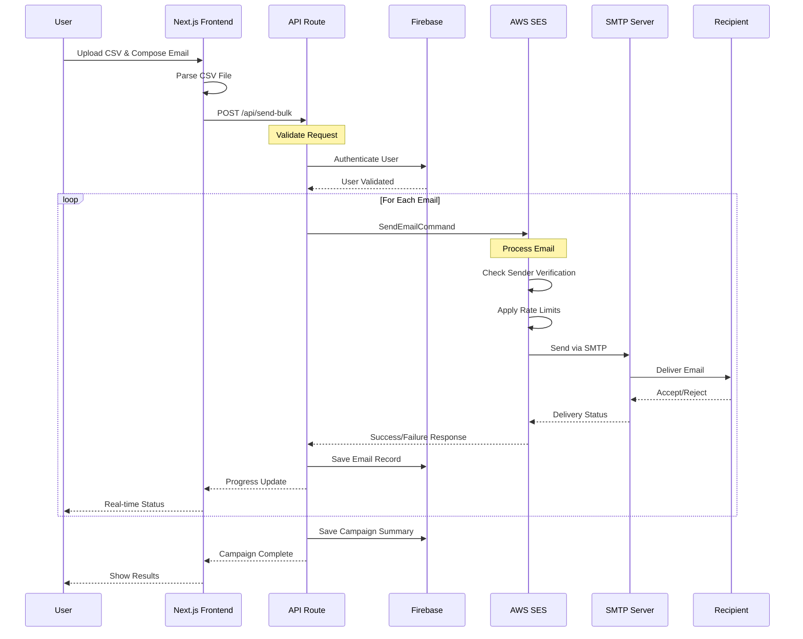

## 📧 AWS SES Integration Architecture

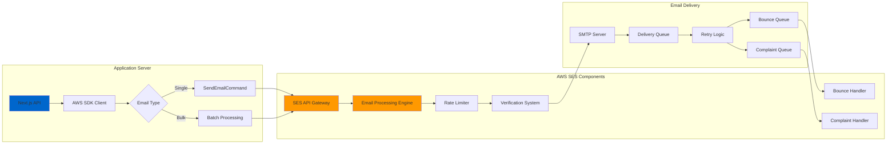

## 🔐 Authentication & Authorization Flow

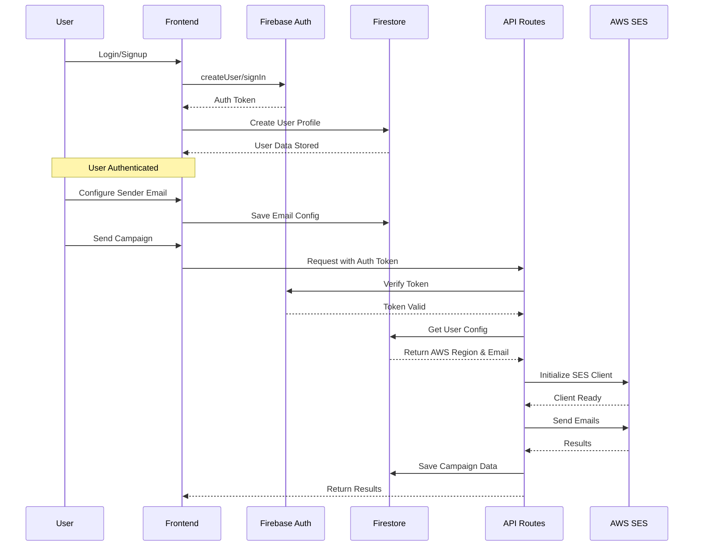

## 🗄️ Data Flow Architecture

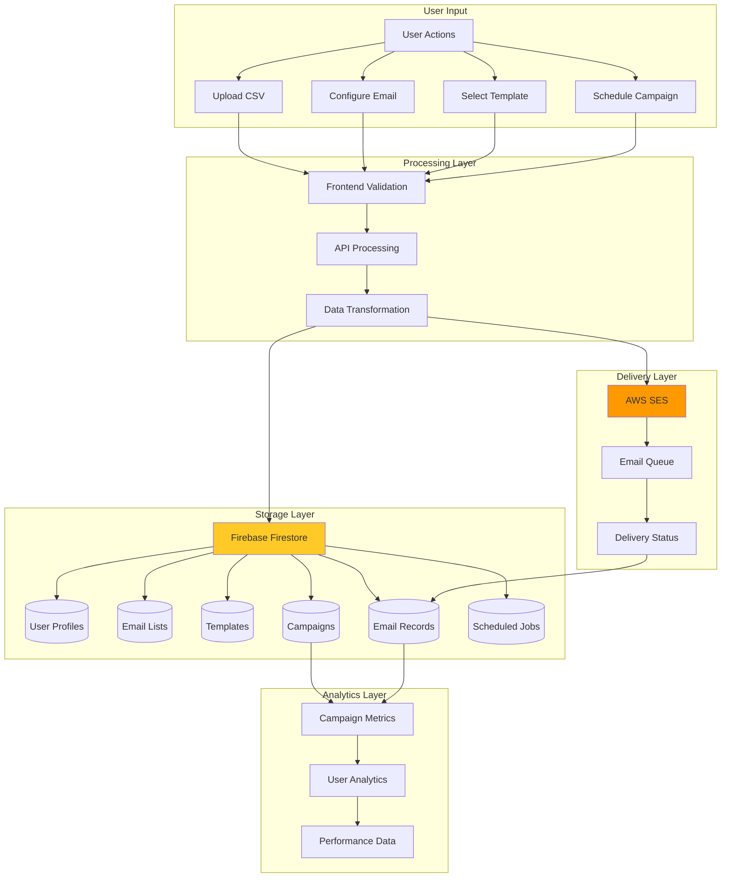

## ⚙️ AWS SES Configuration & Setup

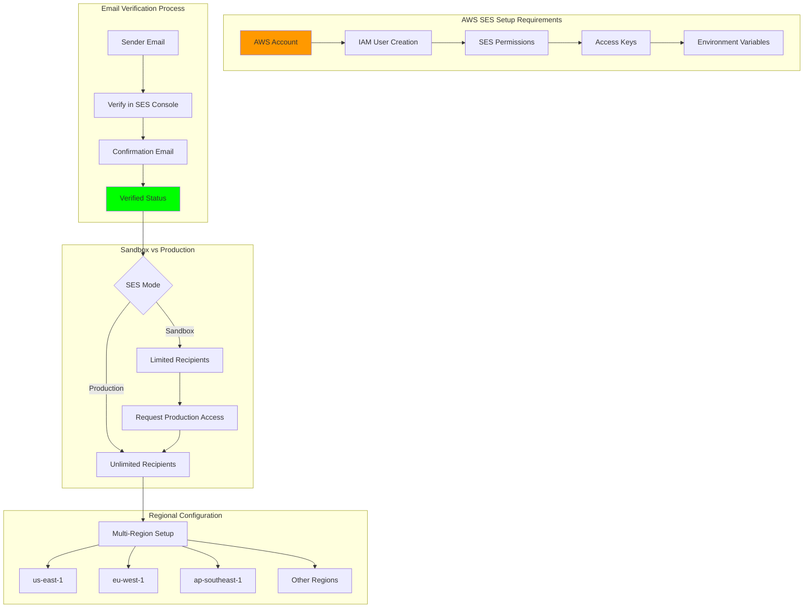

## 🔄 Email Campaign Lifecycle

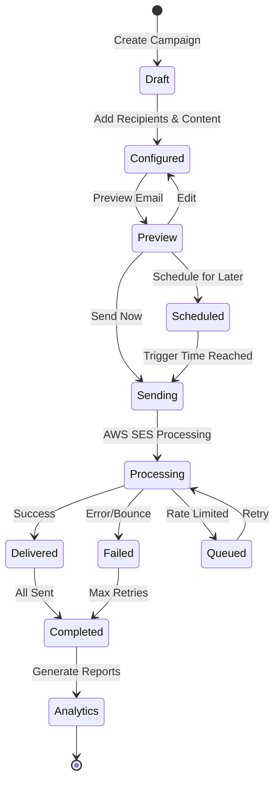

## 🏗️ Component Architecture

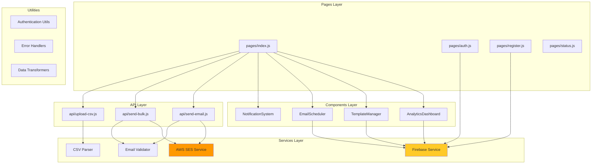

## 📊 AWS SES Email Processing Pipeline

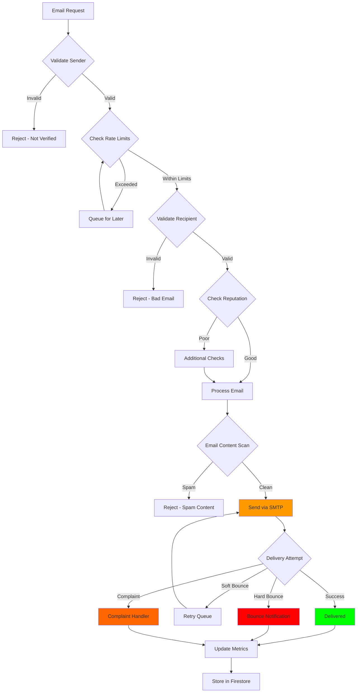

## 🔌 AWS SDK Integration

```mermaid
graph LR
    subgraph "Application Code"
        A[Next.js API Route]
        B[@aws-sdk/client-ses]
        C[SESClient Instance]
        D[SendEmailCommand]
    end

    subgraph "AWS Configuration"
        E[Environment Variables]
        E --> E1[AWS_ACCESS_KEY_ID]
        E --> E2[AWS_SECRET_ACCESS_KEY]
        E --> E3[AWS_REGION]
    end

    subgraph "SES API"
        F[SES Endpoints]
        F --> F1[SendEmail]
        F --> F2[SendBulkEmail]
        F --> F3[GetSendQuota]
        F --> F4[GetSendStatistics]
    end

    subgraph "Response Handling"
        G[Success Response]
        H[Error Response]
        I[Retry Logic]
    end

    A --> B
    B --> C
    E --> C
    C --> D
    D --> F
    F --> G
    F --> H
    H --> I
    I --> F

    style B fill:#ff9900
    style C fill:#ff9900
    style F fill:#ff9900
```

## 📈 Real-time Progress Tracking

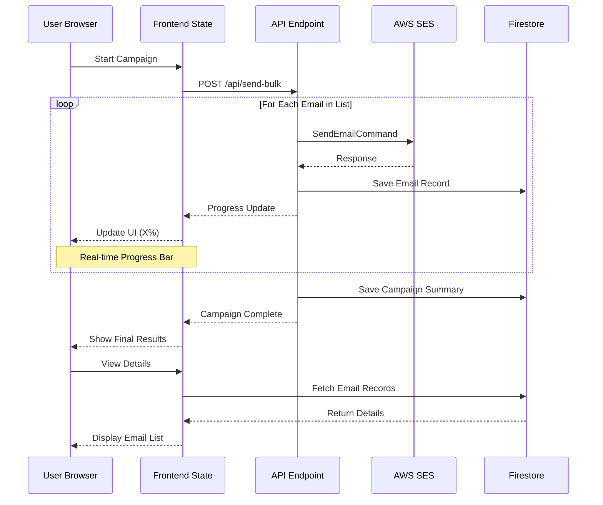

## 🔐 Security Architecture

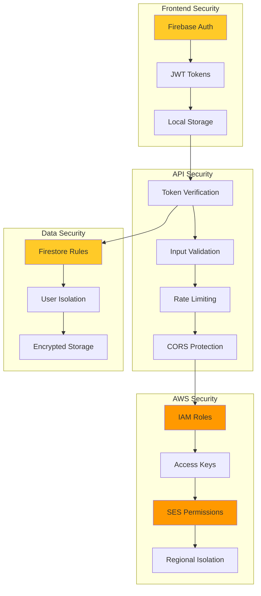

## 📦 Deployment Architecture

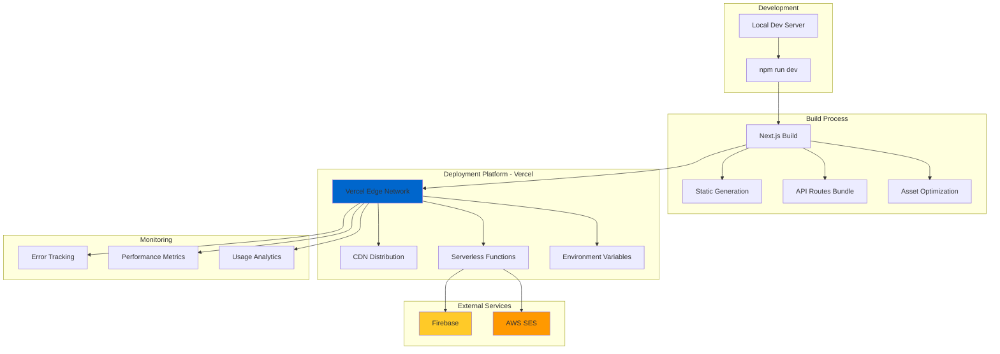

## 🎯 Key Technical Points for Research

### AWS SES Integration:
1. **SDK Usage:** `@aws-sdk/client-ses` v3
2. **Authentication:** IAM Access Keys
3. **Rate Limiting:** Built-in SES rate limits
4. **Regional Support:** Multi-region configuration
5. **Email Verification:** Required for sender addresses

### Architecture Highlights:
1. **Serverless:** Next.js API Routes on Vercel
2. **Real-time:** Firebase Firestore for live updates
3. **Scalable:** AWS SES handles millions of emails
4. **Secure:** Firebase Auth + IAM roles
5. **Modern:** React + Next.js 13+ architecture

### Performance Considerations:
1. **Batch Processing:** Controlled rate limiting
2. **Error Handling:** Comprehensive retry logic
3. **Monitoring:** Real-time progress tracking
4. **Database:** Optimized Firestore queries
5. **Caching:** Next.js built-in caching

This architecture is production-ready and can scale to handle enterprise-level email campaigns.

